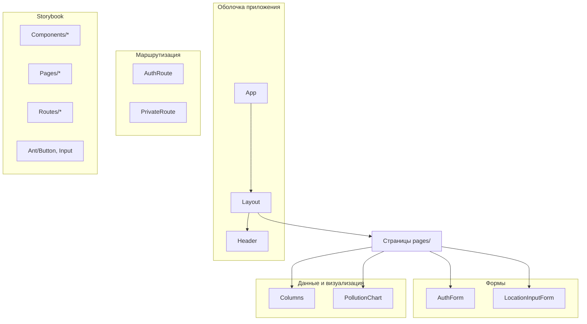

# Библиотека компонентов фронтенда

UI построен на **Ant Design 5** + **@ant-design/charts**. Собственные компоненты приложения лежат в `frontend/src/components/`. Изолированная витрина UI — в **Storybook 8** (`frontend/src/stories/`): компоненты, страницы, route guards и примеры Ant Design.

```bash
npm run storybook -w @events-world/frontend          # dev → http://localhost:6006
npm run build-storybook -w @events-world/frontend    # → frontend/storybook-static
```

---

## Обзор



| Слой      | Путь                         | Назначение                                       |
| --------- | ---------------------------- | ------------------------------------------------ |
| Корень    | `components/App/`            | Точка входа React, подключает роутер             |
| Layout    | `components/Layout/`         | Ant Design Layout: шапка, контент, футер         |
| Навигация | `components/Header/`         | Горизонтальное меню, auth-aware                  |
| Формы     | `components/Form/`           | Вход, регистрация, ввод локации                  |
| Таблицы   | `components/columns/`        | Колонки Ant Design Table для истории AQI         |
| Графики   | `components/PollutionChart/` | Столбчатая диаграмма загрязнителей               |
| Guards    | `routes/`                    | `AuthRoute`, `PrivateRoute`                      |
| Storybook | `src/stories/`               | Витрина компонентов, страниц, routes, Ant Design |

---

## Компоненты приложения

### `App`

**Файл:** `frontend/src/components/App/App.tsx`

Корневой компонент. Рендерит `MainRouter` внутри `.App`. Стили: `App.css` (layout, content padding).

```tsx
import App from './components/App/App';
// index.tsx → <App />
```

---

### `Layout` (`AppLayout`)

**Файл:** `frontend/src/components/Layout/Layout.tsx`

Обёртка страниц на базе `antd.Layout`:

- **Header** — вложенный `AppHeader`
- **Content** — `<Outlet />` (React Router), padding `0 50px`
- **Footer** — копирайт

Используется как parent-route в `MainRouter.tsx`.

| Prop | Тип | Описание                                        |
| ---- | --- | ----------------------------------------------- |
| —    | —   | Без props; дочерние маршруты через `<Outlet />` |

---

### `Header` (`AppHeader`)

**Файл:** `frontend/src/components/Header/Header.tsx`

Горизонтальное меню `antd.Menu` (theme `dark`). Состояние авторизации из `AuthContext`.

**Пункты для гостя:** О нас · Вход · Регистрация  
**Пункты для пользователя:** О нас · Местоположение · Информация о городе · Статьи · email · Выйти

| Поведение            | Описание                               |
| -------------------- | -------------------------------------- |
| `selectedKeys`       | Синхронизируется с `location.pathname` |
| `handleLogout`       | `logout()` → redirect `/login`         |
| `data-role="logout"` | Маркер для Cypress e2e                 |

Зависимости: `react-router-dom`, `AuthContext`.

---

### `AuthForm`

**Файл:** `frontend/src/components/Form/AuthForm.tsx`

Форма входа и регистрации на `antd.Form`.

| Prop       | Тип                     | Описание                        |
| ---------- | ----------------------- | ------------------------------- |
| `mode`     | `'login' \| 'register'` | Режим формы                     |
| `onFinish` | `(values) => void`      | Callback при успешной валидации |

**Поля:**

| Поле              | Правила                                |
| ----------------- | -------------------------------------- |
| `email`           | required, type email                   |
| `password`        | required, min 6, pattern `/[a-z]/`     |
| `confirmPassword` | только register; совпадение с password |

Кнопка submit **disabled**, пока форма невалидна (`validateOnly`).

**Использование:** `AuthPage` → `api.post('/auth/login' | '/auth/register')`.

```tsx
<AuthForm mode="login" onFinish={handleLoginFinish} />
<AuthForm mode="register" onFinish={handleRegisterFinish} />
```

---

### `LocationInputForm`

**Файл:** `frontend/src/components/Form/LocationInputForm.tsx`

Inline-форма поиска по адресу/локации.

| Prop       | Тип                          | Описание                     |
| ---------- | ---------------------------- | ---------------------------- |
| `onSubmit` | `(location: string) => void` | Callback с введённой строкой |

После submit поля сбрасываются (`form.resetFields()`).

**Использование:** `LocationInputPage` → геокодинг через Яндекс API → запрос загрязнения.

```tsx
<LocationInputForm onSubmit={handleLocationSubmit} />
```

---

### `Columns`

**Файл:** `frontend/src/components/columns/Columns.tsx`

Не React-компонент, а **массив конфигурации колонок** для `antd.Table`.

| Колонка      | dataIndex   | Особенности                         |
| ------------ | ----------- | ----------------------------------- |
| Адрес        | `address`   |                                     |
| Широта       | `latitude`  |                                     |
| Долгота      | `longitude` |                                     |
| Дата и время | `dateTime`  |                                     |
| Индекс AQI   | `aqi`       | `Tag` с цветом из `aqiColorMapping` |

Константы подписей и цветов: `frontend/src/constants/constants.ts` (`aqiMapping`, `aqiColorMapping`).

**Использование:**

```tsx
import { Columns } from '../components/columns/Columns';

<Table dataSource={pollutions} columns={Columns} rowKey="id" />;
```

Страницы: `CityInfoPage`, `LocationInputPage`.

---

### `PollutionChart`

**Файл:** `frontend/src/components/PollutionChart/PollutionChart.tsx`

Столбчатая диаграмма `@ant-design/charts` (`Column`) — концентрации загрязнителей по адресам.

| Prop   | Тип              | Описание                                    |
| ------ | ---------------- | ------------------------------------------- |
| `data` | `CombinedData[]` | Массив записей (локация + components + aqi) |

Внутри: `generateChartData(data)` → `ChartDataType[]` → `Column` с `chartConfig` из constants.

**chartConfig** (`constants.ts`):

| Параметр     | Значение                        |
| ------------ | ------------------------------- |
| `height`     | 400                             |
| `xField`     | `address`                       |
| `yField`     | `value`                         |
| `stack`      | `true`                          |
| `colorField` | `parameter` (co, no2, pm2_5, …) |

**Использование:**

```tsx
<PollutionChart data={pollutions} />
```

Страницы: `CityInfoPage`, `LocationInputPage`.

---

## Route guards

Не лежат в `components/`, но являются частью UI-слоя маршрутизации.

### `PrivateRoute`

**Файл:** `frontend/src/routes/PrivateRoute.tsx`

Авторизован → `<Outlet />`, иначе → `<Navigate to="/login" />`.

Защищает: `/location`, `/city-info`.

### `AuthRoute`

**Файл:** `frontend/src/routes/AuthRoute.tsx`

Гость → `<Outlet />`, авторизован → `<Navigate to="/location" />`.

Защищает: `/login`, `/register`.

---

## Карта «страница → компоненты»

| Страница            | Компоненты приложения                            | Ant Design (напрямую)                                        |
| ------------------- | ------------------------------------------------ | ------------------------------------------------------------ |
| `AuthPage`          | `AuthForm`                                       | `Tabs`, `message`                                            |
| `LocationInputPage` | `LocationInputForm`, `PollutionChart`, `Columns` | `Table`, `Button`, …                                         |
| `CityInfoPage`      | `PollutionChart`, `Columns`                      | `Form`, `Input`, `Table`, `List`, `Tag`, `Button`, `message` |
| `ArticlesListPage`  | —                                                | `Table`, `Input`, `Select`, `Pagination`                     |
| `ArticlePage`       | —                                                | `Typography`, `Button`                                       |
| `ArticleCreatePage` | —                                                | `Form`, `Input`, `Button`                                    |
| `AboutPage`         | —                                                | `Typography`                                                 |
| `Error404Page`      | —                                                | `Result`                                                     |

---

## Storybook

Storybook запускается **отдельно** от CRA dev-server и позволяет просматривать UI в изоляции: с мок-авторизацией, предзагруженным Redux-состоянием и без реальных HTTP-запросов (где это настроено в декораторах).

### Структура каталога

```
frontend/
├── .storybook/
│   ├── main.ts                 # stories glob, addons, CRA preset
│   └── preview.ts              # глобальные стили (index.css, App.css)
└── src/stories/
    ├── decorators.tsx          # Router, Auth, Redux, Layout
    ├── fixtures/mockData.ts    # мок-данные загрязнений и статей
    ├── components/             # stories компонентов приложения
    ├── pages/                  # stories страниц
    ├── routes/                 # stories route guards
    └── Ant/                    # примеры Ant Design Button, Input
```

Stories подхватываются glob'ом `src/**/*.stories.@(ts|tsx)`; autodocs включается тегом `autodocs` в meta.

### Конфигурация

| Файл                             | Содержание                                                                                                                                |
| -------------------------------- | ----------------------------------------------------------------------------------------------------------------------------------------- |
| `frontend/.storybook/main.ts`    | CRA preset (`babelOptions: {}` — обязательно для совместимости с Storybook 8), addons essentials/interactions/links, `staticDirs: public` |
| `frontend/.storybook/preview.ts` | `layout: padded`, импорт глобальных стилей приложения                                                                                     |

### Декораторы (`stories/decorators.tsx`)

Переиспользуемые обёртки для stories, которым нужен контекст приложения:

| Декоратор                    | Назначение                                                                    |
| ---------------------------- | ----------------------------------------------------------------------------- |
| `withRouter(initialEntries)` | `MemoryRouter` с заданным URL                                                 |
| `withAuth(loggedIn)`         | `AuthProvider`; для `true` — пользователь `user@example.com` в `localStorage` |
| `withRedux(preloadedState)`  | Redux store (pollutions slice + RTK Query APIs)                               |
| `withLayout(initialEntries)` | `AppLayout` + `<Outlet />` для дочерней story                                 |
| `withPollutions(data)`       | Redux с предзагруженной историей загрязнений                                  |
| `withArticles(page, query)`  | RTK Query cache для списка статей                                             |
| `withArticle(article, id)`   | RTK Query cache для одной статьи                                              |

### Каталог stories

#### `Components/`

| Story             | Файл                                       | Варианты                             |
| ----------------- | ------------------------------------------ | ------------------------------------ |
| Header            | `components/Header.stories.tsx`            | Guest, Authenticated, OnLocationPage |
| Layout            | `components/Layout.stories.tsx`            | Guest, Authenticated                 |
| AuthForm          | `components/AuthForm.stories.tsx`          | Login, Register                      |
| LocationInputForm | `components/LocationInputForm.stories.tsx` | Default                              |
| PollutionChart    | `components/PollutionChart.stories.tsx`    | SingleCity, MultipleCities, Empty    |
| PollutionTable    | `components/PollutionTable.stories.tsx`    | Default (колонки из `Columns.tsx`)   |

#### `Pages/`

| Story             | Файл                                  | Варианты                 |
| ----------------- | ------------------------------------- | ------------------------ |
| AboutPage         | `pages/AboutPage.stories.tsx`         | Default                  |
| AuthPage          | `pages/AuthPage.stories.tsx`          | Login, Register          |
| LocationInputPage | `pages/LocationInputPage.stories.tsx` | Empty                    |
| CityInfoPage      | `pages/CityInfoPage.stories.tsx`      | Empty, WithPollutionData |
| ArticlesListPage  | `pages/ArticlesListPage.stories.tsx`  | Default, Empty           |
| ArticlePage       | `pages/ArticlePage.stories.tsx`       | Default                  |
| ArticleCreatePage | `pages/ArticleCreatePage.stories.tsx` | Default                  |
| Error404Page      | `pages/Error404Page.stories.tsx`      | Default                  |

#### `Routes/`

| Story        | Файл                              | Варианты                     |
| ------------ | --------------------------------- | ---------------------------- |
| PrivateRoute | `routes/PrivateRoute.stories.tsx` | Authenticated, GuestRedirect |
| AuthRoute    | `routes/AuthRoute.stories.tsx`    | Guest, AuthenticatedRedirect |

#### `Ant/` — примитивы Ant Design

**`Ant/Button`** (`stories/Ant/Button.stories.tsx`): Primary, Default, Dashed, Text, Link.  
Controls: `type`, `size`, `shape`, `ghost`, `loading`, `danger`, `disabled`, `block`, `htmlType`, `children`.

**`Ant/Input`** (`stories/Ant/Input.stories.tsx`): Outlined; Filled (large, error, showCount).  
Controls: `type`, `size`, `variant`, `status`, `disabled`, `showCount`, `value`, `placeholder`.

### Мок-данные (`fixtures/mockData.ts`)

| Экспорт             | Использование                        |
| ------------------- | ------------------------------------ |
| `mockPollutionData` | одна запись `CombinedData`           |
| `mockPollutionList` | две записи для таблицы и графика     |
| `mockArticles`      | массив статей                        |
| `mockArticlesPage`  | ответ API списка статей с пагинацией |

### Ограничения в Storybook

| Сценарий                                         | Поведение                                                                          |
| ------------------------------------------------ | ---------------------------------------------------------------------------------- |
| Отправка форм на `AuthPage`, `ArticleCreatePage` | UI работает; реальные запросы к API не мокируются — submit завершится ошибкой сети |
| `CityInfoPage` (Empty)                           | При монтировании запрашивает `/api/pollutions` — без бэкенда возможны toast-ошибки |
| `LocationInputPage`                              | Поиск локации вызывает Яндекс Geocoder и OWM через сервисы приложения              |
| Страницы с `withArticles` / `withPollutions`     | Данные отображаются из предзагруженного store без HTTP                             |

Для интерактивной проверки с API запускайте полный стек (`docker compose up` или `npm run dev` + `npm run start-client`).

---

## Общие типы данных

Компоненты `PollutionChart`, `Columns` и страницы используют типы из `frontend/src/types/types.ts`:

| Тип             | Описание                                             |
| --------------- | ---------------------------------------------------- |
| `LocationData`  | `address`, `latitude`, `longitude`                   |
| `PollutionData` | `components`, `aqi`, `dateTime`                      |
| `CombinedData`  | `LocationData` + `PollutionData`                     |
| `ChartDataType` | `{ address, parameter, value }` — формат для графика |
| `ArticleType`   | поля статьи + `author_id`                            |

---

## Как добавить компонент

### 1. Компонент приложения

```
frontend/src/components/MyWidget/
├── MyWidget.tsx
└── MyWidget.css          # опционально
```

```tsx
// MyWidget.tsx
import React from 'react';

interface MyWidgetProps {
  title: string;
}

const MyWidget: React.FC<MyWidgetProps> = ({ title }) => <div className="my-widget">{title}</div>;

export default MyWidget;
```

Подключить на нужной странице в `frontend/src/pages/`.

### 2. Story для компонента

```tsx
// frontend/src/stories/components/MyWidget.stories.tsx
import type { Meta, StoryObj } from '@storybook/react';
import { fn } from '@storybook/test';
import MyWidget from '../../components/MyWidget/MyWidget';
import { withRouter } from '../decorators';

const meta: Meta<typeof MyWidget> = {
  title: 'Components/MyWidget',
  component: MyWidget,
  tags: ['autodocs'],
  decorators: [withRouter(['/about'])],
  args: { onAction: fn() },
};

export default meta;
type Story = StoryObj<typeof MyWidget>;

export const Default: Story = {
  args: { title: 'Пример' },
};
```

Если компонент зависит от авторизации, Redux или layout — подключите декораторы из `stories/decorators.tsx` (см. `Header.stories.tsx`, `CityInfoPage.stories.tsx`).

### 3. Story для страницы

Страницы обычно оборачивают в `withLayout`, `withAuth(true)` и при необходимости `withPollutions` / `withArticles`. Пример: `stories/pages/CityInfoPage.stories.tsx`.

### 4. Колонки таблицы

Для новых таблиц можно вынести конфиг по аналогии с `Columns.tsx`:

```tsx
export const MyColumns = [{ title: '...', dataIndex: '...', key: '...' }];
```

---

## Зависимости UI

| Пакет                | Использование                                                   |
| -------------------- | --------------------------------------------------------------- |
| `antd`               | Layout, Menu, Form, Table, Button, Input, Tag, Tabs, message, … |
| `@ant-design/icons`  | `MailOutlined`, `LockOutlined` в `AuthForm`                     |
| `@ant-design/charts` | `Column` в `PollutionChart`                                     |
| `react-router-dom`   | Layout Outlet, Header links, route guards                       |
| `react-redux`        | `CityInfoPage`, `LocationInputPage` — pollutions slice          |
