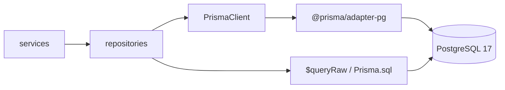
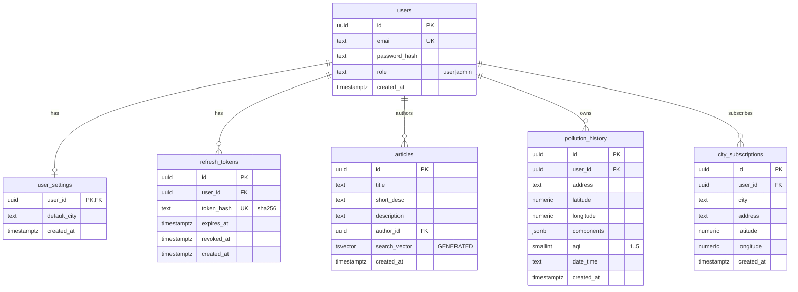

# База данных и Prisma ORM

PostgreSQL 17, доступ через **Prisma ORM 7** и драйвер **`@prisma/adapter-pg`**.

| Артефакт               | Путь                                                                            |
| ---------------------- | ------------------------------------------------------------------------------- |
| Схема (модели)         | `backend/prisma/schema.prisma`                                                  |
| SQL-миграции           | `backend/prisma/migrations/`                                                    |
| Конфиг CLI             | `backend/prisma.config.ts`                                                      |
| Singleton клиента      | `backend/src/db/prisma.ts`                                                      |
| Сгенерированный Client | `backend/src/generated/prisma/` (в `.gitignore`, `postinstall` / `db:generate`) |
| Data access            | `backend/src/repositories/*.ts`                                                 |

```bash
npm run db:generate -w @events-world/backend   # сгенерировать Client
npm run db:migrate -w @events-world/backend    # dev: создать и применить миграцию
npm run migrate                                # deploy: применить pending-миграции
npm run db:studio -w @events-world/backend     # Prisma Studio
```

При старте сервера миграции применяются автоматически (`prisma migrate deploy` в `server.ts`).

---

## Архитектура слоя данных



- **CRUD** — Prisma Client API (`create`, `findMany`, `updateMany`, …).
- **Транзакции** — `prisma.$transaction` (регистрация, ротация refresh-токена).
- **PostgreSQL-специфика** — `$queryRaw`: полнотекст (`tsvector`), `array_agg` для cron-подписок.
- **DTO** — repositories маппят Prisma-модели (`camelCase`) в API-типы (`snake_case` где нужно).

### Prisma-модели ↔ таблицы

| Prisma model       | Таблица              | Файл репозитория              |
| ------------------ | -------------------- | ----------------------------- |
| `User`             | `users`              | `user.repository.ts`          |
| `UserSettings`     | `user_settings`      | `user.repository.ts`          |
| `RefreshToken`     | `refresh_tokens`     | `refresh-token.repository.ts` |
| `Article`          | `articles`           | `article.repository.ts`       |
| `PollutionHistory` | `pollution_history`  | `pollution.repository.ts`     |
| `CitySubscription` | `city_subscriptions` | `subscription.repository.ts`  |

### Переменные окружения

| Переменная     | Назначение                                                                  |
| -------------- | --------------------------------------------------------------------------- |
| `DATABASE_URL` | Строка подключения PostgreSQL для Prisma CLI и адаптера                     |
| `PG_POOL_SIZE` | Размер пула соединений `pg` внутри `@prisma/adapter-pg` (по умолчанию `10`) |

### Docker

БД обычно в контейнере `postgres:17`, backend — на хосте (`npm run dev`) или в образе.

- **Чистая БД:** `docker compose down -v` → при следующем старте применится `20260611120000_init`.
- Legacy-таблица `schema_migrations` (старый SQL-раннер) **не используется**; трекинг — `_prisma_migrations`.

---

## ER-диаграмма



---

## Таблицы

### `users`

| Колонка         | Тип           | Описание                               |
| --------------- | ------------- | -------------------------------------- |
| `id`            | `uuid` PK     | `gen_random_uuid()`                    |
| `email`         | `text` UNIQUE | Email (нижний регистр при регистрации) |
| `password_hash` | `text`        | bcrypt (12 rounds)                     |
| `role`          | `text`        | `user` \| `admin`, CHECK               |
| `created_at`    | `timestamptz` | DEFAULT `now()`                        |

### `user_settings`

Создаётся в транзакции при регистрации.

| Колонка        | Тип                                       | Описание                         |
| -------------- | ----------------------------------------- | -------------------------------- |
| `user_id`      | `uuid` PK, FK → `users` ON DELETE CASCADE |                                  |
| `default_city` | `text`                                    | Город по умолчанию (опционально) |
| `created_at`   | `timestamptz`                             | DEFAULT `now()`                  |

### `refresh_tokens`

| Колонка      | Тип                                   | Описание                             |
| ------------ | ------------------------------------- | ------------------------------------ |
| `id`         | `uuid` PK                             |                                      |
| `user_id`    | `uuid` FK → `users` ON DELETE CASCADE |                                      |
| `token_hash` | `text` UNIQUE                         | SHA-256 хэш refresh-токена           |
| `expires_at` | `timestamptz`                         | Срок действия (30 дней по умолчанию) |
| `revoked_at` | `timestamptz` NULL                    | Время отзыва                         |
| `created_at` | `timestamptz`                         |                                      |

**Индексы:** `user_id`, `expires_at`

### `articles`

| Колонка         | Тип                                    | Описание                               |
| --------------- | -------------------------------------- | -------------------------------------- |
| `id`            | `uuid` PK                              |                                        |
| `title`         | `text` NOT NULL                        |                                        |
| `short_desc`    | `text`                                 | Краткое описание                       |
| `description`   | `text` NOT NULL                        | Полный текст                           |
| `author_id`     | `uuid` FK → `users` ON DELETE SET NULL | Автор                                  |
| `search_vector` | `tsvector` GENERATED                   | Полнотекстовый поиск, конфиг `russian` |
| `created_at`    | `timestamptz`                          |                                        |

**Индексы:** `created_at DESC`, `author_id`, GIN на `search_vector`

`search_vector` = веса A/B/C для `title` / `short_desc` / `description`. Колонка создаётся raw SQL в миграции (Prisma не поддерживает GENERATED `tsvector`).

### `pollution_history`

| Колонка      | Тип                                    | Описание                                     |
| ------------ | -------------------------------------- | -------------------------------------------- |
| `id`         | `uuid` PK                              |                                              |
| `user_id`    | `uuid` FK → `users` ON DELETE SET NULL | Владелец записи                              |
| `address`    | `text`                                 | Адрес / название города                      |
| `latitude`   | `numeric(9,6)`                         |                                              |
| `longitude`  | `numeric(9,6)`                         |                                              |
| `components` | `jsonb`                                | `{ co, no, no2, o3, so2, pm2_5, pm10, nh3 }` |
| `aqi`        | `smallint`                             | 1–5, CHECK                                   |
| `date_time`  | `text`                                 | Форматированная дата измерения               |
| `created_at` | `timestamptz`                          |                                              |

**Индексы:** `created_at`, `(latitude, longitude)`

### `city_subscriptions`

| Колонка      | Тип                                   | Описание                   |
| ------------ | ------------------------------------- | -------------------------- |
| `id`         | `uuid` PK                             |                            |
| `user_id`    | `uuid` FK → `users` ON DELETE CASCADE |                            |
| `city`       | `text`                                | Нормализованное имя города |
| `address`    | `text`                                | Адрес из геокодинга        |
| `latitude`   | `numeric(9,6)`                        |                            |
| `longitude`  | `numeric(9,6)`                        |                            |
| `created_at` | `timestamptz`                         |                            |

**Ограничения:** UNIQUE `(user_id, city)`  
**Индексы:** `user_id`, `city`

Используется cron-задачей для ежечасного обновления данных и WebSocket push.

---

## Миграции (Prisma Migrate)

| Миграция              | Содержание                                                       |
| --------------------- | ---------------------------------------------------------------- |
| `20260611120000_init` | Полная схема: все таблицы, индексы, CHECK, `search_vector` + GIN |

### Workflow

1. Изменить `backend/prisma/schema.prisma`
2. `npm run db:migrate -w @events-world/backend` — создаёт SQL-миграцию и применяет
3. Закоммитить `prisma/migrations/`

Для PostgreSQL-специфики (GENERATED columns, GIN) — дописать SQL вручную в файл миграции после `--create-only`.

### Трекинг

- Таблица `_prisma_migrations` хранит применённые миграции
- Legacy-таблица `schema_migrations` (старый раннер) больше не используется

---

## Транзакции

| Операция               | Реализация                                        |
| ---------------------- | ------------------------------------------------- |
| Регистрация            | `prisma.$transaction` — `users` + `user_settings` |
| Ротация refresh-токена | `prisma.$transaction` — revoke + insert           |

---

## Raw SQL через Prisma

Некоторые запросы используют `$queryRaw`:

- Полнотекстовый поиск статей (`search_vector`, `websearch_to_tsquery`)
- Агрегация подписчиков по городам (`array_agg`, `GROUP BY`)
